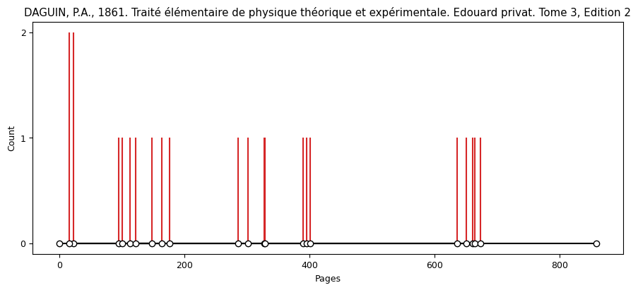
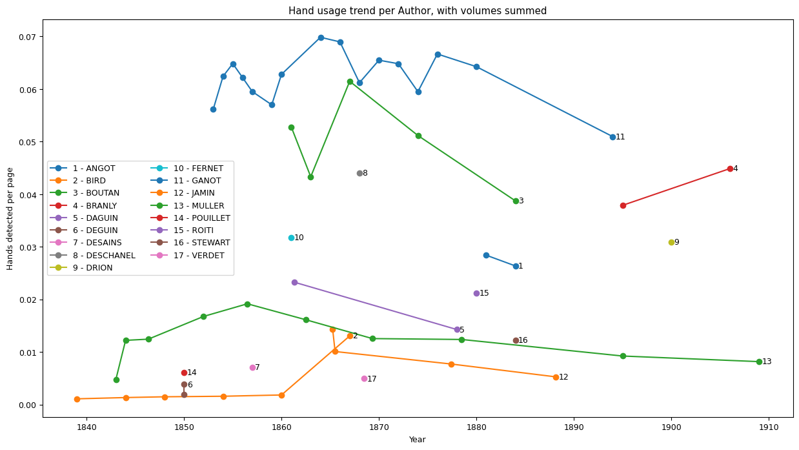

# Distant-Seeing

*Text: Distant Seeing: Applying Machine Vision Algorithms to Historical Scientific Images*

# Info
Professor: Dr. Jérôme Baudry\
Supervisors: Dr. Mihailescu Ion-Gabriel & Sidorenko Semion\
Student: Naël Dillenbourg\
Year: 2023

# About
Part of the distant-seeing project, this repository uses object detection to localize key features in physics books illustrations. We then explore ways of analysing these features, by comparing their usage, the frequency of appearance and by comparing duplicates across books.

# Research summary
In this paper, we tested numerous models made for object detection before concluding that fine-tuning a model was a necessary step towards the analysis of features in physics books.
We compared various parameters to fine-tune to the best of our ability a model capable of extracting features from a large dataset of illustrations. We find that optimal performances should be reached by a model using a Unet++ architecture, with a resnext101_32x16d encoder, using Instagram encoder weights, a batch size of 32 and a distribution of illustrations containing features between $50\%$ and $33\%$ according to our tests. We then analysed several books and found no particular trends in the usage of hands throughout time in physics books but did seem to find trends regarding the usage of hands with specific chapters. We also found examples of reused engraving plates with hands as features in illustrations or redrawn illustrations across authors.


*More plots produced during this research are included in the [report](report/Report.pdf)*
# Installation and Usage
A conda environment was used to during this project. A dependencies list was compiled from this environment.
```
conda create --name env_distant_seeing --file \notebooks\env.txt
```
## Training a model
*The following Jupyter Notebooks located in /notebooks/Training serve this purpose:*
* **Training_model.ipynb** can be used to train a model.\
    A json file with the segmented images of illustration with and without features is needed. Folders containing all illustrations with features/without features and all illustrations combined is also needed. [Universal Data Tool (UDT)](https://github.com/UniversalDataTool/universal-data-tool) can be use to produce such json files.
* **Compare_models.ipynb** can be used to perform a comparison between models performances.\
    For testing set, a json file containing illustrations with and without features in addition to a image folder should be used. This data should not have been used for training purpose.
* **result.csv** contains already computed benchmark. 
## Extracting features
*The following Jupyter Notebooks located in /notebooks/Extract_Features serve this purpose:*
* **model_to_prediction.ipynb** can be used to apply a model to some images and output data. This notebook need a folder with extracted features and a path to a model built with **Training_model.ipynb**.
* **Display_Predictions.ipynb** can be used to display all prediction made from **model_to_prediction.ipynb**.
## Analysing
*The following Jupyter Notebooks located in /notebooks/Analysis serve this purpose:*
* **Analysis.ipynb** can be used for analysis of the data. In addition to the predictions made by **model_to_prediction.ipynb**, this model needs a CSV file of all books used.
    The following analysis are already plotted:
    * Frequency of the features in books as detected by the model
    * Real frequency of the features in books as detected by manual search
    * Frequency (number of predictions per page) of features per year and author
    * Frequency of features per year and author + tome
    * Frequency of features per year and author + edition
    * Bar plot of frequency of feature per year
    * Bar plot of frequency of feature per decade
    * Histogram of number of pages per books
* **PCA_Similarity.ipynb** performs PCA to find close match in illustration for a subset of the images. Cell "Copy image to folder" in **Display_Predictions.ipynb** can generate a folder with only images containing a specific feature.
    This notebook is useful for the following:
    * Computing matrix of duplicate illustrations across books
    * Displaying similarity matrix
    * Dsiplaying similar images
# License
distant-seeing - Naël Dillenbourg    
Copyright (c) 2023 EPFL    
This program is licensed under the terms of the GPL. 
